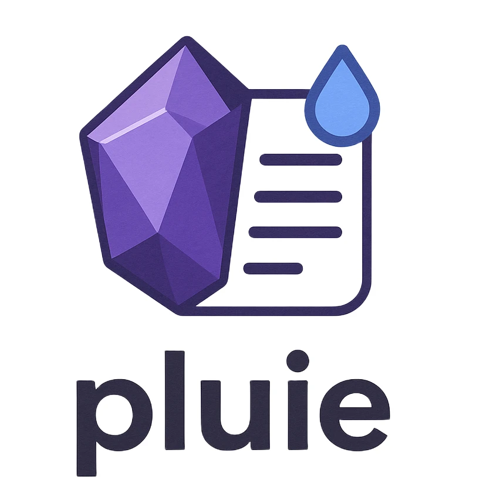

# Pluie 🌧️ - Modern Markdown Wiki Server



Pluie is a lightning-fast, privacy-focused markdown wiki server built in Go that transforms your Obsidian vault into a beautiful, searchable website. Designed for simplicity and performance, Pluie offers the perfect balance between powerful features and ease of use.

## ✨ Core Features

### 🔗 **Intelligent Wiki Linking**

- **Obsidian-compatible**: Full support for `[[Note Name]]` and `[[Note Name|Display Text]]` syntax
- **Smart backreferences**: Automatically tracks which notes reference each other
- **Broken link handling**: Gracefully handles missing or private notes
- **Cross-folder linking**: Link between notes in different directories seamlessly

### 🔍 **Real-Time Search**

- **Instant results**: Live search as you type
- **Smart scoring**: Prioritizes filename matches over folder path matches
- **Keyboard shortcuts**: `Cmd/Ctrl + K` to focus search instantly
- **Disabled JavaScript fallback**: Works even with JavaScript disabled

### 🗂️ **Hierarchical Organization**

- **Folder-based structure**: Maintains your existing Obsidian folder organization
- **Collapsible tree view**: Expand/collapse folders with persistent state
- **Bulk operations**: Expand all or collapse all folders with one click
- **Visual hierarchy**: Clear indentation and folder icons

### 🔒 **Granular Privacy Control**

- **Note-level privacy**: Control visibility with frontmatter `public: true/false`
- **Folder-level privacy**: Set default privacy for entire folders using `.pluie` files
- **Server-level defaults**: Configure global public/private behavior
- **Security-first**: Private notes are completely hidden from public access

### 📖 **Rich Content Rendering**

- **Full Markdown support**: CommonMark compliant with extensions
- **Syntax highlighting**: Code blocks with language-specific highlighting
- **Frontmatter display**: YAML metadata beautifully rendered
- **Table of contents**: Auto-generated TOC with smooth scrolling
- **Responsive design**: Optimized for desktop and mobile viewing

### ⚡ **Performance & Deployment**

- **Single binary**: No dependencies, just one executable file
- **Docker ready**: Complete containerization with hot-reload development
- **Memory efficient**: Loads all notes into memory for instant access
- **Fast startup**: Builds backreferences and tree structure on launch
- **Static assets**: Embedded CSS and JavaScript, no external dependencies

## 🏆 Competitive Advantages

### **vs. Obsidian Publish**

#### ✅ **Pluie Advantages**

- **🆓 Completely free**: No subscription fees or usage limits
- **🏠 Self-hosted**: Full control over your data and infrastructure
- **🔧 Customizable**: Open source with full customization potential
- **🐳 Docker native**: Easy deployment with container orchestration
- **📁 Folder privacy**: Granular privacy control at folder level
- **⚡ Instant search**: Real-time search without page reloads
- **🎯 Lightweight**: Minimal resource usage and fast performance
- **🔒 Privacy-first**: Your notes NEVER leave your infrastructure

#### ⚠️ **Obsidian Publish Advantages**

- **☁️ Managed hosting**: No server maintenance required
- **🎨 Advanced theming**: More sophisticated customization options
- **📊 Analytics**: Built-in visitor analytics and insights
- **🌐 CDN delivery**: Global content delivery network
- **💼 Commercial support**: Professional support and SLA options

### **vs. Hugo** (or other static site generators)

#### ✅ **Pluie Advantages**

- **🚀 Zero configuration**: Works out of the box with your existing notes
- **🔄 Dynamic content**: No build step required, changes appear instantly
- **🔗 Native wiki links**: Built-in support for `[[]]` syntax without plugins
- **🔍 Live search**: Real-time search functionality included
- **📱 Interactive UI**: Dynamic folder navigation and TOC
- **🔒 Privacy controls**: Built-in public/private note management
- **📊 Backreferences**: Automatic bidirectional linking
- **🎯 Purpose-built**: Specifically designed for knowledge bases and wikis

#### ⚠️ **Hugo Advantages**

- **📈 Massive ecosystem**: Thousands of themes and plugins available
- **🏗️ Static generation**: Better SEO and caching for public sites
- **🎨 Advanced templating**: More flexible content presentation
- **📚 Multi-format support**: Beyond markdown (AsciiDoc, reStructuredText, etc.)
- **🌐 Mature platform**: Larger community and extensive documentation

## 🚀 Quick Start

### Docker (Recommended)

1. **Clone and setup**:

   ```bash
   git clone https://github.com/EwenQuim/pluie.git
   cd pluie
   mkdir vault
   echo "# Welcome to Pluie" > vault/Index.md
   ```

2. **Start the server**:

   ```bash
   docker-compose up --build
   ```

3. **Access your wiki**: Open `http://localhost:9999`

### Development with Hot Reload

```bash
# Start development environment with automatic rebuilds
docker compose -f docker-compose.dev.yml up --build --watch
```

### Native Installation

```bash
# Install and run locally
go mod download
go run . -path ./vault
```

## 📁 Directory Structure

```
pluie/
├── vault/                  # Your markdown notes
│   ├── Index.md            # Default home page
│   ├── projects/          # Organized in folders
│   │   ├── .pluie         # Folder privacy settings
│   │   └── project1.md
│   └── private/
│       ├── .pluie         # Mark entire folder as private
│       └── secrets.md
├── docker-compose.yml     # Production deployment
├── docker-compose.dev.yml # Development with hot reload
└── Dockerfile            # Multi-stage build
```

## ⚙️ Configuration

### Environment Variables

```bash
# Site customization
SITE_TITLE="My Knowledge Base"
SITE_ICON="/static/icon.png"
SITE_DESCRIPTION="Personal notes and documentation"

# Privacy settings
PUBLIC_BY_DEFAULT=false        # Default: false (notes are private)
HOME_NOTE_SLUG=Index           # Default home page

# Server settings
PORT=9999                     # Default: 9999
```

### Privacy Control

#### Note-level (frontmatter):

```yaml
---
public: true
title: "My Public Note"
tags: [documentation, public]
---
# My Public Note
This note will be visible to everyone.
```

#### Folder-level (`.pluie` file):

```yaml
---
public: false
description: "Private project notes"
---
```

## 🎯 Use Cases

- **📚 Personal Knowledge Base**: Organize your learning and research
- **👥 Team Documentation**: Share knowledge within your organization
- **📖 Project Wikis**: Document projects with interconnected notes
- **🎓 Academic Research**: Manage research notes with citations and references
- **💼 Company Handbooks**: Internal documentation with privacy controls
- **🏠 Digital Gardens**: Cultivate and share your thoughts publicly

## 🔧 Advanced Features

### Wiki Link Processing

- Supports both `[[Note Name]]` and `[[Note Name|Display Text]]` formats
- Automatically resolves links across folder boundaries
- Handles special characters and spaces in note names
- Graceful fallback for missing or private notes

### Search Capabilities

- **Filename priority**: Matches in note titles ranked higher
- **Folder path matching**: Finds notes by their location
- **Real-time filtering**: Updates results as you type
- **Keyboard navigation**: Full keyboard accessibility

### Table of Contents

- **Auto-generation**: Extracts headings from markdown content
- **Smooth scrolling**: Click to jump to any section
- **Active highlighting**: Shows current reading position
- **Nested structure**: Supports all heading levels (H1-H6)

## 🤝 Contributing

Pluie is open source and welcomes contributions! Whether it's bug reports, feature requests, or code contributions, we appreciate your help in making Pluie better.

```bash
# Development setup
git clone https://github.com/EwenQuim/pluie.git
cd pluie
go mod download

# Run tests
go test ./...

# Start development server
go run . -path ./testdata/test_notes
```

## 📄 License

MIT License - see [LICENSE](LICENSE) for details.

## 🙏 Acknowledgments

Built with:

- [Go](https://golang.org/) - Fast, reliable backend
- [Fuego](https://github.com/go-fuego/fuego) - Modern Go web framework
- [Gomponents](https://github.com/maragudk/gomponents) - Type-safe HTML generation
- [HTMX](https://htmx.org/) - Dynamic interactions without complex JavaScript

---

**Ready to transform your notes into a beautiful wiki?** 🚀

[Get Started](#-quick-start) | [View Examples](https://github.com/EwenQuim/pluie/tree/main/testdata) | [Report Issues](https://github.com/EwenQuim/pluie/issues)
